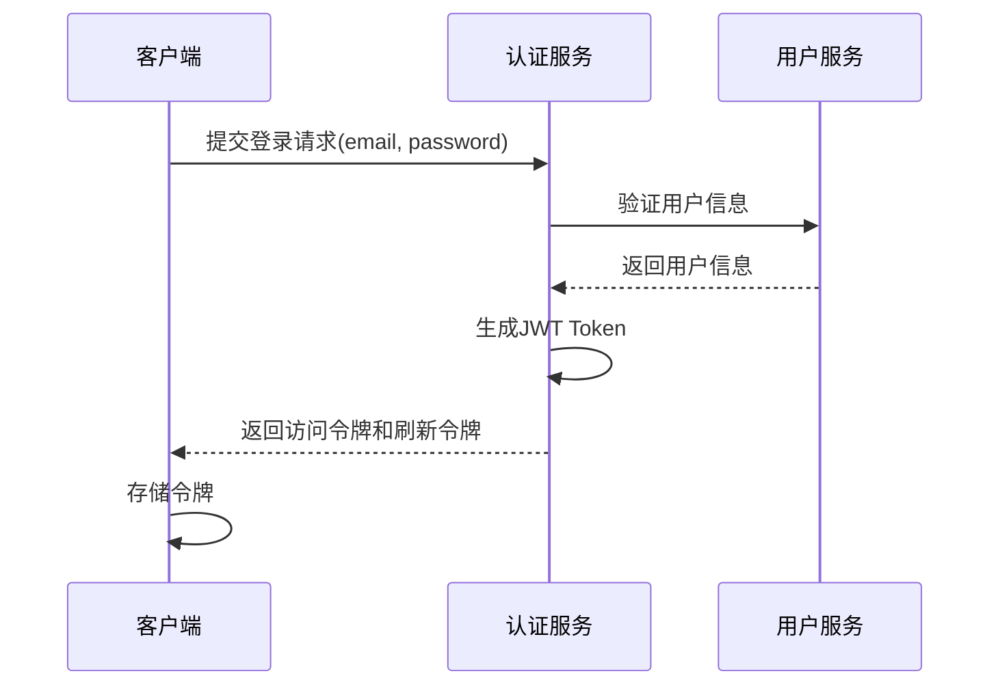

# 智能中医诊疗系统技术文档（V2）

## 1. 项目概述

### 1.1 项目简介
智能中医诊疗系统（SmartTCM-Agent-SYSTEM）是一个基于 FastAPI 构建的现代化中医问诊平台。系统融合了大语言模型、知识图谱和传统中医理论，提供精准的中医辨证问诊、古籍查询、医案参考、药材咨询等全场景服务。

### 1.2 核心功能
- 用户权限管理（admin/user双权限体系）
- 中医智能问诊对话系统
- 病例管理与诊疗记录
- 中医知识库检索（药材、方剂、古籍）
- 数据统计与可视化分析
- 系统监控与日志管理

### 1.3 技术架构
- 后端框架：FastAPI + SQLModel
- 数据库：PostgreSQL
- 认证机制：JWT Token
- 日志系统：Structlog
- API文档：Swagger/OpenAPI

## 2. 系统架构设计

### 2.1 整体架构
```
┌─────────────────┐    ┌──────────────────┐    ┌─────────────────┐
│   前端应用      │────│   API网关        │────│   后端服务      │
└─────────────────┘    └──────────────────┘    └─────────────────┘
                              │                         │
                    ┌─────────┴─────────┐      ┌─────────┴─────────┐
                    │   认证授权服务    │      │   业务逻辑层      │
                    └───────────────────┘      └───────────────────┘
                              │                         │
                    ┌─────────┴─────────┐      ┌─────────┴─────────┐
                    │   数据访问层      │──────│   数据模型层      │
                    └───────────────────┘      └───────────────────┘
                              │
                    ┌─────────┴─────────┐
                    │   数据库(PostgreSQL) │
                    └───────────────────┘
```

### 2.2 模块划分
1. **用户权限模块**：负责用户注册、登录、权限验证
2. **对话系统模块**：处理用户问诊对话流程
3. **病例管理模块**：维护用户诊疗记录
4. **文件上传模块**：处理文件上传到阿里云和下载
5. **知识库模块**：管理知识库的创建、更新和删除，以及文档的上传和处理
6. **统计分析模块**：提供模型使用统计、用户诊疗信息查看和病症分布可视化
7. **系统管理模块**：监控系统运行状态

## 3. 权限管理体系

### 3.1 用户角色定义
系统定义了三种用户角色：
- **patient（普通用户）**：可以进行中医问诊、查看个人诊疗记录
- **admin（管理员）**：拥有所有权限，可查看所有用户数据、系统统计信息

### 3.2 权限控制策略

- 基于JWT Token的无状态认证机制
- 角色基础访问控制（RBAC）
- 细粒度接口权限验证

### 3.3 认证流程


## 4. 核心功能模块

### 4.1 权限管理模块

#### 4.1.1 用户模型设计

##### User（用户表）
| 字段名 | 类型 | 描述 |
|-------|------|------|
| id | UUID | 用户ID |
| username | String | 用户名 |
| email | String | 邮箱地址 |
| password_hash | String | 密码哈希 |
| is_admin | bool | true为admin,false为user |
| has_image_Info(用户画像) | bool     | true 为已填写，false为未填写 |
| phone | String | 手机号 |
| gender | String | 性别 |
| birth_date | Date | 出生日期 |
| constitution_type | String | 体质类型 |
| avatar_url | String | 头像URL |
| is_active | Boolean | 是否激活 |
| created_at | DateTime | 创建时间 |
| updated_at | DateTime | 更新时间 |

##### Patient（患者信息表）

当用户准备询问时，需要获取该用户的个人以往信息标签（需判断是否填写，如果未填写，前端弹出页面填写），

| 字段名                  | 类型     | 描述           |
| ----------------------- | -------- | -------------- |
| id                      | UUID     | 患者ID         |
| user_id                 | UUID     | 关联用户       |
| medical_history         | String   | 既往病史       |
| family_history          | String   | 家族病史       |
| allergy_info            | String   | 过敏信息       |
| emergency_contact_name  | String   | 紧急联系人姓名 |
| emergency_contact_phone | String   | 紧急联系人电话 |
| created_at              | DateTime | 创建时间       |
| updated_at              | DateTime | 更新时间       |

##### 4.1.2 接口设计

##### 用户注册

- **接口路径**：`POST /api/v1/users/register`
- **请求方法**：POST
- **功能描述**：新用户注册账户
- **请求参数**：
  - username (string): 用户名
  - email (string): 邮箱地址
  - password (string): 密码
- **响应数据**：

```json
{
  "RequestId": "请求唯一标识符",
  "Code": "业务状态码",
  "Message": "状态码描述",
  "HostId": "请求访问的站点ID",
  "Data": {
    "user_id": "string"
  },
  "Success": true
}
```

##### 用户登录

- **接口路径**：`POST /api/v1/users/login`
- **请求方法**：POST
- **功能描述**：用户身份验证并获取访问令牌
- **请求参数**：
  - email (string): 邮箱地址
  - password (string): 密码
- **响应数据**：

```json
{
  "RequestId": "string",
  "Code": "string",
  "Message": "string",
  "HostId": "string",
  "Data": {
    "access_token": "string",
    "refresh_token": "string",
    "expires_in": 0,
    "user_id": "a169451c-8525-4352-b8ca-070dd449a1a5"
  },
  "Success": true
}
```

##### 刷新令牌

- **接口路径**：`POST /api/v1/users/refresh`
- **请求方法**：POST
- **功能描述**：刷新访问令牌
- **请求参数**：
  - refresh_token (string): 刷新令牌
- **响应数据**：

```json
{
  "RequestId": "string",
  "Code": "string",
  "Message": "string",
  "HostId": "string",
  "Data": {
    "access_token": "string",
    "refresh_token": "string",
    "expires_in": 0
  },
  "Success": true
}
```

##### 获取当前用户信息

- **接口路径**：`GET /api/v1/users/me`
- **请求方法**：GET
- **功能描述**：获取当前登录用户信息
- **权限要求**：需要认证
- **响应数据**：

```json
{
  "RequestId": "string",
  "Code": "string",
  "Message": "string",
  "HostId": "string",
  "Data": {
    "id": "497f6eca-6276-4993-bfeb-53cbbbba6f08",
    "username": "string",
    "email": "string",
    "password_hash": "string",
    "is_admin": false,
    "has_image_Info": true,
    "phone": "string",
    "gender": "string",
    "birth_date": "2019-08-24",
    "constitution_type": "string",
    "avatar_url": "string",
    "is_active": true,
    "created_at": "2019-08-24T14:15:22.123Z",
    "updated_at": "2019-08-24T14:15:22.123Z"
  },
  "Success": true
}
```

##### 用户登出

- **接口路径**：`POST /api/v1/users/logout`
- **请求方法**：POST
- **功能描述**：用户登出系统，清除令牌
- **权限要求**：需要认证
- **响应数据**：

```json
{
  "RequestId": "string",
  "Code": "string",
  "Message": "string",
  "HostId": "string",
  "Data": null,
  "Success": true
}
```

### 4.2 对话系统模块

#### 4.2.1 数据模型设计

##### Conversation（对话记录表）
| 字段名 | 类型 | 描述 |
|-------|------|------|
| id | UUID | 对话ID |
| user_id | UUID | 用户ID |
| session_id | String | 会话ID |
| conversation_type | String | 对话类型 |
| title | String | 对话标题 |
| status | String | 对话状态 |
| total_messages | Integer | 消息总数 |
| created_at | DateTime | 创建时间 |
| updated_at | DateTime | 更新时间 |

##### Message（消息表）
| 字段名 | 类型 | 描述 |
|-------|------|------|
| id | UUID | 消息ID |
| conversation_id | UUID | 对话ID |
| role | String | 消息角色(system,user,assistant) |
| content | String | 消息内容 |
| message_type | String | 消息类型 |
| message_metadata | JSON | 元数据 |
| is_deleted | Boolean | 是否删除 |
| created_at | DateTime | 创建时间 |

#### 4.2.2 接口设计

##### 创建对话

- **接口路径**：`POST /api/v1/conversations`
- **请求方法**：POST
- **功能描述**：创建新的对话
- **请求参数（Body）**：
  - user_id (string): 用户ID
  - conversation_type (string): 对话类型
  - title (string): 对话标题
- **响应数据**：

```json
{
  "RequestId": "req-20240520103000-001",
  "Code": "200",
  "Message": "对话创建成功",
  "HostId": "api-gateway-01",
  "Data": {
    "id": "c9d8e7f6-5432-10fe-dcba-ba0987654321",
    "user_id": "a1b2c3d4-5678-90ef-abcd-1234567890ab",
    "session_id": "ses-87654321-0fed-cba9-8765-abcdef123456",
    "conversation_type": "medical_consult",
    "title": "感冒症状咨询",
    "status": "active",
    "total_messages": 0,
    "created_at": "2024-05-20T10:30:00.000Z",
    "updated_at": "2024-05-20T10:30:00.000Z"
  },
  "Success": true
}
```

##### 获取对话列表

- **接口路径**：`GET /api/v1/conversations`
- **请求方法**：GET
- **功能描述**：获取用户对话列表
- **请求参数（Query）**：
  - user_id (string): 用户ID
  - page (integer): 页码
  - page_size (integer): 每页数量
- **响应数据**：

```json
{
  "RequestId": "req-20240520103500-002",
  "Code": "200",
  "Message": "对话列表获取成功",
  "HostId": "api-gateway-01",
  "Data": {
    "items": [
      {
        "id": "c9d8e7f6-5432-10fe-dcba-ba0987654321",
        "user_id": "a1b2c3d4-5678-90ef-abcd-1234567890ab",
        "session_id": "ses-87654321-0fed-cba9-8765-abcdef123456",
        "conversation_type": "medical_consult",
        "title": "感冒症状咨询",
        "status": "active",
        "total_messages": 2,
        "created_at": "2024-05-20T10:30:00.000Z",
        "updated_at": "2024-05-20T10:40:00.000Z"
      },
      {
        "id": "e1f2g3h4-9876-54dc-ba09-87654321abcd",
        "user_id": "a1b2c3d4-5678-90ef-abcd-1234567890ab",
        "session_id": "ses-12345678-fed0-9abc-1234-abcdef654321",
        "conversation_type": "health_advice",
        "title": "日常饮食建议",
        "status": "completed",
        "total_messages": 5,
        "created_at": "2024-05-19T15:20:00.000Z",
        "updated_at": "2024-05-19T15:45:00.000Z"
      }
    ],
    "pagination": {
      "page": 1,
      "page_size": 10,
      "total": 2,
      "total_pages": 1
    }
  },
  "Success": true
}
```

##### 获取对话详情

- **接口路径**：`GET /api/v1/conversations/{conversation_id}`
- **请求方法**：GET
- **功能描述**：获取指定对话的详细信息
- **请求参数（Path）**：
  - conversation_id (string): 对话ID
- **响应数据**：

```json
{
  "RequestId": "req-20240520104500-003",
  "Code": "200",
  "Message": "对话详情获取成功",
  "HostId": "api-gateway-01",
  "Data": {
    "conversation": {
      "id": "c9d8e7f6-5432-10fe-dcba-ba0987654321",
      "user_id": "a1b2c3d4-5678-90ef-abcd-1234567890ab",
      "session_id": "ses-87654321-0fed-cba9-8765-abcdef123456",
      "conversation_type": "medical_consult",
      "title": "感冒症状咨询",
      "status": "active",
      "total_messages": 2,
      "created_at": "2024-05-20T10:30:00.000Z",
      "updated_at": "2024-05-20T10:40:00.000Z"
    },
    "messages": [
      {
        "id": "m1n2o3p4-5678-90ef-abcd-1234567890ab",
        "conversation_id": "c9d8e7f6-5432-10fe-dcba-ba0987654321",
        "role": "user",
        "content": "我最近有点咳嗽、流鼻涕，是不是感冒了？",
        "message_type": "text",
        "message_metadata": {},
        "is_deleted": false,
        "created_at": "2024-05-20T10:35:00.000Z"
      },
      {
        "id": "m2n3o4p5-6789-01ef-abcd-2345678901bc",
        "conversation_id": "c9d8e7f6-5432-10fe-dcba-ba0987654321",
        "role": "assistant",
        "content": "根据你描述的症状，大概率是普通感冒，建议多喝温水、注意休息。",
        "message_type": "text",
        "message_metadata": {},
        "is_deleted": false,
        "created_at": "2024-05-20T10:40:00.000Z"
      }
    ]
  },
  "Success": true
}
```

##### 删除对话

- **接口路径**：`DELETE /api/v1/conversations/{conversation_id}`
- **请求方法**：DELETE
- **功能描述**：删除指定对话
- **请求参数（Path）**：
  - conversation_id (string): 对话ID
- **响应数据**：

```json
{
  "RequestId": "req-20240520105000-004",
  "Code": "200",
  "Message": "对话删除成功",
  "HostId": "api-gateway-01",
  "Data": {
    "deleted_conversation_id": "c9d8e7f6-5432-10fe-dcba-ba0987654321",
    "user_id": "a1b2c3d4-5678-90ef-abcd-1234567890ab",
    "delete_time": "2024-05-20T10:50:00.000Z"
  },
  "Success": true
}
```

##### 发送消息

- **接口路径**：`POST /api/v1/chat/send`
- **请求方法**：POST
- **功能描述**：向对话发送消息
- **请求参数（Body）**：
  - conversation_id (string): 对话ID
  - content (string): 消息内容
  - role (string): 消息角色
- **响应数据**：

```json
{
  "RequestId": "req-20240520105500-005",
  "Code": "200",
  "Message": "消息发送成功",
  "HostId": "api-gateway-01",
  "Data": {
    "id": "m3n4o5p6-7890-12ef-abcd-3456789012cd",
    "conversation_id": "c9d8e7f6-5432-10fe-dcba-ba0987654321",
    "role": "user",
    "content": "那需要吃什么药缓解吗？",
    "message_type": "text",
    "message_metadata": {},
    "is_deleted": false,
    "created_at": "2024-05-20T10:55:00.000Z",
    "updated_conversation_total_messages": 3
  },
  "Success": true
}
```

##### 获取消息列表

- **接口路径**：`GET /api/v1/chat/messages`
- **请求方法**：GET
- **功能描述**：获取对话中的消息列表
- **请求参数（Query）**：
  - conversation_id (string): 对话ID
  - page (integer): 页码
  - page_size (integer): 每页数量
- **响应数据**：

```json
{
  "RequestId": "req-20240520110000-006",
  "Code": "200",
  "Message": "消息列表获取成功",
  "HostId": "api-gateway-01",
  "Data": {
    "items": [
      {
        "id": "m1n2o3p4-5678-90ef-abcd-1234567890ab",
        "conversation_id": "c9d8e7f6-5432-10fe-dcba-ba0987654321",
        "role": "user",
        "content": "我最近有点咳嗽、流鼻涕，是不是感冒了？",
        "message_type": "text",
        "message_metadata": {},
        "is_deleted": false,
        "created_at": "2024-05-20T10:35:00.000Z"
      },
      {
        "id": "m2n3o4p5-6789-01ef-abcd-2345678901bc",
        "conversation_id": "c9d8e7f6-5432-10fe-dcba-ba0987654321",
        "role": "assistant",
        "content": "根据你描述的症状，大概率是普通感冒，建议多喝温水、注意休息。",
        "message_type": "text",
        "message_metadata": {},
        "is_deleted": false,
        "created_at": "2024-05-20T10:40:00.000Z"
      },
      {
        "id": "m3n4o5p6-7890-12ef-abcd-3456789012cd",
        "conversation_id": "c9d8e7f6-5432-10fe-dcba-ba0987654321",
        "role": "user",
        "content": "那需要吃什么药缓解吗？",
        "message_type": "text",
        "message_metadata": {},
        "is_deleted": false,
        "created_at": "2024-05-20T10:55:00.000Z"
      }
    ],
    "pagination": {
      "page": 1,
      "page_size": 20,
      "total": 3,
      "total_pages": 1
    }
  },
  "Success": true
}
```

### 4.3 病例管理模块

#### 4.3.1 数据模型设计

##### MedicalCase（病例表）
| 字段名 | 类型 | 描述 |
|-------|------|------|
| id | UUID | 病例ID |
| patient_id | UUID | 患者ID |
| case_code | String | 病例编号 |
| chief_complaint | String | 主诉 |
| present_illness | String | 现病史 |
| symptoms | JSON | 症状描述 |
| tongue_description | String | 舌象描述 |
| pulse_description | String | 脉象描述 |
| syndrome_type | String | 辨证结果 |
| syndrome_confidence | Decimal | 辨证置信度 |
| prescription_name | String | 推荐方剂名称 |
| prescription_ingredients | JSON | 方剂组成 |
| dosage_instruction | String | 用法用量 |
| precautions | String | 注意事项 |
| status | String | 病例状态 |
| created_at | DateTime | 创建时间 |
| updated_at | DateTime | 更新时间 |

#### 4.3.2 接口设计

##### 创建病例

- **接口路径**：`POST /api/v1/medical-cases`
- **请求方法**：POST
- **功能描述**：创建新的病例记录
- **请求参数（Body）**：
  - patient_id (string): 患者ID
  - chief_complaint (string): 主诉
  - present_illness (string): 现病史
  - symptoms (object): 症状描述
  - tongue_description (string): 舌象描述
  - pulse_description (string): 脉象描述
  - syndrome_type (string): 辨证结果
  - syndrome_confidence (number): 辨证置信度
  - prescription_name (string): 推荐方剂名称
  - prescription_ingredients (array): 方剂组成
  - dosage_instruction (string): 用法用量
  - precautions (string): 注意事项
- **响应数据**：

```json
{
  "RequestId": "req-20240520143000-007",
  "Code": "200",
  "Message": "病例创建成功",
  "HostId": "api-gateway-02",
  "Data": {
    "id": "mc9876543-210f-edcb-a098-7654321fedcb",
    "case_code": "MC20240520001",
    "patient_id": "p12345678-90ab-cdef-1234-567890abcdef",
    "status": "draft",
    "created_at": "2024-05-20T14:30:00.000Z"
  },
  "Success": true
}
```

##### 获取病例列表

- **接口路径**：`GET /api/v1/medical-cases`
- **请求方法**：GET
- **功能描述**：获取病例列表
- **请求参数（Query）**：
  - patient_id (string): 患者ID
  - page (integer): 页码
  - page_size (integer): 每页数量
- **响应数据**：

```json
{
  "RequestId": "req-20240520144000-008",
  "Code": "200",
  "Message": "病例列表获取成功",
  "HostId": "api-gateway-02",
  "Data": {
    "items": [
      {
        "id": "mc9876543-210f-edcb-a098-7654321fedcb",
        "case_code": "MC20240520001",
        "patient_id": "p12345678-90ab-cdef-1234-567890abcdef",
        "chief_complaint": "发热、咳嗽3天",
        "syndrome_type": "风热犯肺证",
        "prescription_name": "桑菊饮加减",
        "status": "completed",
        "created_at": "2024-05-20T14:30:00.000Z"
      },
      {
        "id": "mc1234567-89fe-dcba-0123-456789abcdef",
        "case_code": "MC20240519002",
        "patient_id": "p12345678-90ab-cdef-1234-567890abcdef",
        "chief_complaint": "胃脘胀痛1周",
        "syndrome_type": "肝气犯胃证",
        "prescription_name": "柴胡疏肝散加减",
        "status": "completed",
        "created_at": "2024-05-19T09:15:00.000Z"
      }
    ],
    "pagination": {
      "page": 1,
      "page_size": 10,
      "total": 2,
      "total_pages": 1
    }
  },
  "Success": true
}
```

##### 获取病例详情

- **接口路径**：`GET /api/v1/medical-cases/{case_id}`
- **请求方法**：GET
- **功能描述**：获取指定病例的详细信息
- **请求参数（Path）**：
  - case_id (string): 病例ID
- **响应数据**：

```json
{
  "RequestId": "req-20240520145000-009",
  "Code": "200",
  "Message": "病例详情获取成功",
  "HostId": "api-gateway-02",
  "Data": {
    "id": "mc9876543-210f-edcb-a098-7654321fedcb",
    "patient_id": "p12345678-90ab-cdef-1234-567890abcdef",
    "case_code": "MC20240520001",
    "chief_complaint": "发热、咳嗽3天",
    "present_illness": "患者3天前无明显诱因出现发热，体温最高38.5℃，伴咳嗽、咳少量白痰，无胸闷气促",
    "symptoms": {
      "fever": true,
      "temperature": 38.5,
      "cough": true,
      "sputum": "少量白色黏液痰",
      "fatigue": true
    },
    "tongue_description": "舌质红，苔薄黄",
    "pulse_description": "脉浮数",
    "syndrome_type": "风热犯肺证",
    "syndrome_confidence": 0.89,
    "prescription_name": "桑菊饮加减",
    "prescription_ingredients": [
      {"name": "桑叶", "dosage": "10g"},
      {"name": "菊花", "dosage": "10g"},
      {"name": "杏仁", "dosage": "6g"},
      {"name": "连翘", "dosage": "10g"},
      {"name": "桔梗", "dosage": "6g"},
      {"name": "甘草", "dosage": "3g"}
    ],
    "dosage_instruction": "每日1剂，水煎400ml，分早晚两次温服",
    "precautions": "忌辛辣油腻食物，多饮水，注意休息",
    "status": "completed",
    "created_at": "2024-05-20T14:30:00.000Z",
    "updated_at": "2024-05-20T15:20:00.000Z"
  },
  "Success": true
}
```

##### 删除病例

- **接口路径**：`DELETE /api/v1/medical-cases/{case_id}`
- **请求方法**：DELETE
- **功能描述**：删除指定病例
- **请求参数（Path）**：
  - case_id (string): 病例ID
- **响应数据**：

```json
{
  "RequestId": "req-20240520160000-010",
  "Code": "200",
  "Message": "病例删除成功",
  "HostId": "api-gateway-02",
  "Data": {
    "deleted_case_id": "mc9876543-210f-edcb-a098-7654321fedcb",
    "patient_id": "p12345678-90ab-cdef-1234-567890abcdef",
    "delete_time": "2024-05-20T16:00:00.000Z"
  },
  "Success": true
}
```


### 4.4 AI对话模块

#### 4.4.1 接口设计

##### 流式对话

- **接口路径**：`POST /api/v1/chat`
- **请求方法**：POST
- **功能描述**：对话生成，适用于需要实时显示回答内容的场景，提供更好的用户体验
- **请求参数（Body）**：
  - user_id (string): 用户ID
  - conversation_id (string): 对话ID
  - message (string): 用户消息内容
  - stream (boolean): 是否启用流式传输（true/false）
- **响应数据（流式）**：
  - 采用Server-Sent Events (SSE)协议，逐字或逐句返回响应内容
  - 每个数据包格式：

```json
{
  "RequestId": "req-20240520121000-009",
  "Code": "200",
  "Message": "对话生成成功",
  "HostId": "api-gateway-01",
  "Data": {
    "id": "resp-20240520121000-009",
    "conversation_id": "c9d8e7f6-5432-10fe-dcba-ba0987654321",
    "response": {"data": {"content": "中", "type": "token"}},
    "created_at": "2024-05-20T12:10:00.000Z"
  },
  "Success": true
}

{
  "RequestId": "req-20240520121000-009",
  "Code": "200",
  "Message": "对话生成成功",
  "HostId": "api-gateway-01",
  "Data": {
    "id": "resp-20240520121000-009",
    "conversation_id": "c9d8e7f6-5432-10fe-dcba-ba0987654321",
    "response": {"data": {"content": "医", "type": "token"}},
    "created_at": "2024-05-20T12:10:00.000Z"
  },
  "Success": true
}
...
```

##### 图节点对话

- **接口路径**：`POST /api/v1/chat/graph`
- **请求方法**：POST
- **功能描述**：基于知识图谱节点的对话，适用于精准查询特定中医概念、药材、方剂等信息
- **请求参数（Body）**：
  - user_id (string): 用户ID
  - conversation_id (string): 对话ID
  - message (string): 用户消息内容
  - stream (boolean): 是否启用流式传输（true/false）
- **响应数据**：

```json

{
  "RequestId": "req-20240520121000-009",
  "Code": "200",
  "Message": "对话生成成功",
  "HostId": "api-gateway-01",
  "Data": {
    "id": "resp-20240520121000-009",
    "conversation_id": "c9d8e7f6-5432-10fe-dcba-ba0987654321",
    "response": "人参是......",
    "created_at": "2024-05-20T12:10:00.000Z"
  },
  "Success": true
}

```

### 4.5 文件上传模块

#### 4.5.1 数据模型设计

##### FileMetadata（文件元数据表）

| 字段名 | 类型 | 描述 |
|-------|------|------|
| id | UUID | 文件ID |
| filename | String | 原始文件名 |
| aliyun_url | String | 阿里云文件URL |
| file_size | Integer | 文件大小（字节） |
| mime_type | String | MIME类型 |
| upload_time | DateTime | 上传时间 |
| uploader_id | UUID | 上传者ID |
| status | String | 文件状态（uploaded/processed/error） |
| tags | JSON | 文件标签 |
| description | String | 文件描述 |
| created_at | DateTime | 创建时间 |
| updated_at | DateTime | 更新时间 |

#### 4.5.2 接口设计

##### 上传文件到阿里云

- **接口路径**：`POST /api/v1/files/upload`
- **请求方法**：POST
- **功能描述**：上传文件到阿里云OSS
- **权限要求**：认证用户
- **请求参数（Form）**：
  - file (file): 要上传的文件
  - description (string, optional): 文件描述
  - tags (array, optional): 文件标签
- **响应数据**：

```json
{
  "RequestId": "string",
  "Code": "string",
  "Message": "string",
  "HostId": "string",
  "Data": {
    "id": "string",
    "filename": "string",
    "aliyun_url": "string",
    "file_size": 0,
    "mime_type": "string",
    "upload_time": "2024-05-20T10:30:00.000Z",
    "status": "uploaded"
  },
  "Success": true
}
```

##### 下载文件

- **接口路径**：`GET /api/v1/files/{file_id}/download`
- **请求方法**：GET
- **功能描述**：从阿里云OSS下载指定文件
- **权限要求**：认证用户
- **请求参数（Path）**：
  - file_id (string): 文件ID
- **响应数据**：文件流

### 4.6 知识库模块

#### 4.6.1 数据模型设计

##### KnowledgeBase（知识库表）

| 字段名 | 类型 | 描述 |
|-------|------|------|
| id | UUID | 知识库ID |
| name | String | 知识库名称 |
| description | Text | 知识库描述 |
| avatar_url | String | 知识库头像URL |
| category | String | 分类 |
| tags | JSON | 标签 |
| creator_id | UUID | 创建者ID |
| status | String | 状态（active/inactive） |
| version | String | 版本 |
| metadata | JSON | 元数据 |
| created_at | DateTime | 创建时间 |
| updated_at | DateTime | 更新时间 |

##### KnowledgeBaseDocument（知识库文档表）
| 字段名 | 类型 | 描述 |
|-------|------|------|
| id | UUID | 文档ID |
| knowledge_base_id | UUID | 知识库ID |
| original_file_id | UUID | 原始文件ID |
| title | String | 文档标题 |
| content | Text | 文档内容 |
| content_vector | Vector | 内容向量（用于相似性搜索） |
| chunks | JSON | 切分后的文本块 |
| processing_status | String | 处理状态（uploaded/processing/processed/error） |
| processing_metadata | JSON | 处理元数据（进度、错误信息等） |
| uploaded_at | DateTime | 上传时间 |
| processed_at | DateTime | 处理完成时间 |
| created_at | DateTime | 创建时间 |
| updated_at | DateTime | 更新时间 |

#### 4.6.2 接口设计

##### 创建知识库（含头像）

- **接口路径**：`POST /api/v1/knowledge/bases`
- **请求方法**：POST
- **功能描述**：创建新的知识库，支持上传头像
- **权限要求**：认证用户
- **请求参数（Body）**：
  - name (string): 知识库名称
  - description (string): 知识库描述
  - avatar_url (string): 知识库头像URL
  - category (string): 分类
  - tags (array, optional): 标签
  - metadata (object, optional): 元数据
- **响应数据**：

```json
{
  "RequestId": "string",
  "Code": "string",
  "Message": "string",
  "HostId": "string",
  "Data": {
    "id": "string",
    "name": "string",
    "category": "string",
    "avatar_url": "string",
    "status": "active",
    "created_at": "2024-05-20T10:30:00.000Z"
  },
  "Success": true
}
```

##### 更新知识库

- **接口路径**：`PUT /api/v1/knowledge/bases/{base_id}`
- **请求方法**：PUT
- **功能描述**：更新指定知识库
- **权限要求**：仅创建者或管理员
- **请求参数（Path）**：
  - base_id (string): 知识库ID
- **请求参数（Body）**：
  - name (string, optional): 知识库名称
  - description (string, optional): 知识库描述
  - avatar_url (string, optional): 知识库头像URL
  - category (string, optional): 分类
  - tags (array, optional): 标签
  - metadata (object, optional): 元数据
  - status (string, optional): 状态
- **响应数据**：

```json
{
  "RequestId": "string",
  "Code": "string",
  "Message": "string",
  "HostId": "string",
  "Data": {
    "id": "string",
    "name": "string",
    "category": "string",
    "avatar_url": "string",
    "status": "active",
    "updated_at": "2024-05-20T10:30:00.000Z"
  },
  "Success": true
}
```

##### 删除知识库

- **接口路径**：`DELETE /api/v1/knowledge/bases/{base_id}`
- **请求方法**：DELETE
- **功能描述**：删除指定知识库
- **权限要求**：仅创建者或管理员
- **请求参数（Path）**：
  - base_id (string): 知识库ID
- **响应数据**：

```json
{
  "RequestId": "string",
  "Code": "string",
  "Message": "string",
  "HostId": "string",
  "Data": {
    "deleted_base_id": "string",
    "deleted_time": "2024-05-20T10:30:00.000Z"
  },
  "Success": true
}
```

##### 上传并处理知识库文档

- **接口路径**：`POST /api/v1/knowledge/bases/{base_id}/documents`
- **请求方法**：POST
- **功能描述**：上传文件到知识库并自动进行加载、索引、切分和存储
- **权限要求**：认证用户
- **请求参数（Path）**：
  - base_id (string): 知识库ID
- **请求参数（Form）**：
  - file (file): 要上传的文件
  - title (string, optional): 文档标题
- **响应数据**：

```json
{
  "RequestId": "string",
  "Code": "string",
  "Message": "string",
  "HostId": "string",
  "Data": {
    "id": "string",
    "knowledge_base_id": "string",
    "original_file_id": "string",
    "title": "string",
    "processing_status": "uploaded",
    "uploaded_at": "2024-05-20T10:30:00.000Z"
  },
  "Success": true
}
```

##### 获取知识库文档列表

- **接口路径**：`GET /api/v1/knowledge/bases/{base_id}/documents`
- **请求方法**：GET
- **功能描述**：获取指定知识库中的文档列表
- **权限要求**：认证用户
- **请求参数（Path）**：
  - base_id (string): 知识库ID
- **请求参数（Query）**：
  - page (integer, optional): 页码，默认1
  - page_size (integer, optional): 每页数量，默认10
  - status (string, optional): 处理状态筛选
- **响应数据**：

```json
{
  "RequestId": "string",
  "Code": "string",
  "Message": "string",
  "HostId": "string",
  "Data": {
    "items": [
      {
        "id": "string",
        "knowledge_base_id": "string",
        "title": "string",
        "processing_status": "processed",
        "uploaded_at": "2024-05-20T10:30:00.000Z",
        "processed_at": "2024-05-20T10:35:00.000Z"
      }
    ],
    "pagination": {
      "page": 1,
      "page_size": 10,
      "total": 1
    }
  },
  "Success": true
}
```

##### 获取文档处理状态

- **接口路径**：`GET /api/v1/knowledge/documents/{document_id}/status`
- **请求方法**：GET
- **功能描述**：获取指定文档的处理状态和进度
- **权限要求**：认证用户
- **请求参数（Path）**：
  - document_id (string): 文档ID
- **响应数据**：

```json
{
  "RequestId": "string",
  "Code": "string",
  "Message": "string",
  "HostId": "string",
  "Data": {
    "id": "string",
    "processing_status": "processing",
    "processing_metadata": {
      "progress": 75,
      "current_step": "indexing",
      "total_steps": 4
    },
    "updated_at": "2024-05-20T10:32:00.000Z"
  },
  "Success": true
}
```

##### 删除知识库文档

- **接口路径**：`DELETE /api/v1/knowledge/documents/{document_id}`
- **请求方法**：DELETE
- **功能描述**：从知识库中删除指定文档
- **权限要求**：仅创建者或管理员
- **请求参数（Path）**：
  - document_id (string): 文档ID
- **响应数据**：

```json
{
  "RequestId": "string",
  "Code": "string",
  "Message": "string",
  "HostId": "string",
  "Data": {
    "deleted_document_id": "string",
    "knowledge_base_id": "string",
    "deleted_time": "2024-05-20T10:30:00.000Z"
  },
  "Success": true
}
```

### 4.7 统计分析模块

#### 4.7.1 数据模型设计

##### ModelUsage（模型使用情况表）

| 字段名 | 类型 | 描述 |
|-------|------|------|
| id | UUID | 记录ID |
| model_name | String | 模型名称 |
| user_id | UUID | 用户ID |
| api_endpoint | String | API端点 |
| request_time | DateTime | 请求时间 |
| response_time | DateTime | 响应时间 |
| processing_duration | Integer | 处理耗时（毫秒） |
| input_tokens | Integer | 输入token数 |
| output_tokens | Integer | 输出token数 |
| success | Boolean | 是否成功 |
| error_message | String | 错误信息（如果失败） |
| created_at | DateTime | 创建时间 |

#### 4.7.2 接口设计

##### 用户诊疗信息查看（管理员）

- **接口路径**：`GET /api/v1/admin/users/{user_id}/cases`
- **请求方法**：GET
- **功能描述**：管理员查看指定用户的诊疗信息
- **权限要求**：admin角色
- **响应数据**：用户病例列表

##### 模型调用情况统计（管理员）

- **接口路径**：`GET /api/v1/admin/models/usage-statistics`
- **请求方法**：GET
- **功能描述**：统计所有模型的调用情况
- **权限要求**：admin角色
- **请求参数（Query）**：
  - start_date (string, optional): 开始日期
  - end_date (string, optional): 结束日期
  - model_name (string, optional): 模型名称筛选
- **响应数据**：模型使用统计信息

```json
{
  "RequestId": "string",
  "Code": "string",
  "Message": "string",
  "HostId": "string",
  "Data": {
    "statistics": [
      {
        "model_name": "gpt-4",
        "total_calls": 1250,
        "successful_calls": 1200,
        "failed_calls": 50,
        "total_input_tokens": 250000,
        "total_output_tokens": 500000,
        "average_response_time": 1200,
        "total_processing_time": 1500000
      },
      {
        "model_name": "claude-2",
        "total_calls": 800,
        "successful_calls": 780,
        "failed_calls": 20,
        "total_input_tokens": 160000,
        "total_output_tokens": 320000,
        "average_response_time": 1800,
        "total_processing_time": 1440000
      }
    ],
    "time_range": {
      "start_date": "2024-05-01",
      "end_date": "2024-05-31"
    }
  },
  "Success": true
}
```

##### 相同病症统计可视化（管理员）

- **接口路径**：`GET /api/v1/admin/statistics/symptoms`
- **请求方法**：GET
- **功能描述**：统计相同病症的分布情况
- **权限要求**：admin角色
- **请求参数（Query）**：
  - start_date (string): 开始日期
  - end_date (string): 结束日期
- **响应数据**：病症统计信息（支持图表展示）

```json
{
  "RequestId": "string",
  "Code": "string",
  "Message": "string",
  "HostId": "string",
  "Data": {
    "symptoms_distribution": [
      {
        "symptom": "咳嗽",
        "count": 125,
        "percentage": 25.5
      },
      {
        "symptom": "发热",
        "count": 98,
        "percentage": 20.0
      },
      {
        "symptom": "头痛",
        "count": 76,
        "percentage": 15.5
      }
    ],
    "total_cases": 490,
    "time_range": {
      "start_date": "2024-05-01",
      "end_date": "2024-05-31"
    }
  },
  "Success": true
}
```

## 5. API接口规范

### 5.1 响应格式

系统采用统一的阿里巴巴标准API响应格式：

```json
{
  "RequestId": "请求唯一标识符",
  "Code": "业务状态码",
  "Message": "状态码描述",
  "HostId": "请求访问的站点ID",
  "Data": "返回的数据内容",
  "Success": "是否成功"
}
```

### 5.2 错误码定义

| 错误码 | 描述 | HTTP状态码 |
|-------|------|-----------|
| Success | 请求成功 | 200 |
| ValidationError | 参数验证失败 | 422 |
| BusinessError | 业务逻辑错误 | 400 |
| Unauthorized | 认证失败 | 401 |
| Forbidden | 权限不足 | 403 |
| NotFound | 资源不存在 | 404 |
| InternalError | 服务器内部错误 | 500 |

### 5.3 认证机制

所有需要认证的接口都需要在请求头中包含：

```
Authorization: Bearer {access_token}
```

## 6. 部署与运维

### 6.1 环境要求

- Python 3.11+
- PostgreSQL 13+
- Redis 6+（可选，用于缓存）

### 6.2 部署步骤
1. 克隆项目代码
2. 安装依赖：`pip install -r requirements.txt`
3. 配置环境变量
4. 初始化数据库
5. 启动服务：`python main.py`

### 6.3 监控与日志
- 系统使用Structlog进行结构化日志记录
- 提供健康检查接口：`GET /health`
- 提供日志状态检查接口：`GET /logs/status`

## 7. 安全设计

### 7.1 数据安全
- 用户密码采用bcrypt加密存储
- 敏感信息传输使用HTTPS加密
- 数据库连接使用SSL加密

### 7.2 访问控制
- 基于JWT的无状态认证
- 接口级别的权限控制
- 防止SQL注入和XSS攻击

### 7.3 审计日志
- 记录用户关键操作
- 记录系统异常事件
- 提供日志查询接口

## 8. 性能优化

### 8.1 数据库优化
- 合理使用索引
- 避免N+1查询问题
- 使用连接池管理数据库连接

### 8.2 缓存策略
- 热点数据缓存
- 查询结果缓存
- 会话信息缓存

### 8.3 异步处理
- 耗时操作异步化
- 使用异步数据库驱动
- 合理使用线程池和进程池